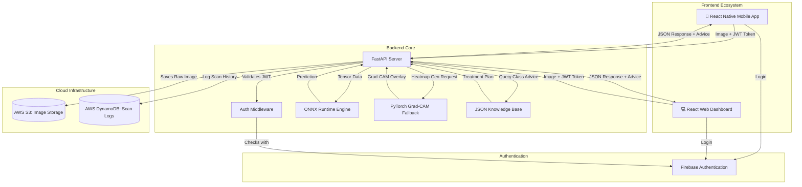
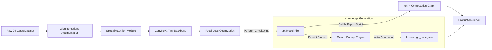

<div align="center">
  <h1>🌱 Plantpulse</h1>
  <p>An AI-powered cross-platform (Web & Mobile) crop disease diagnosis and treatment ecosystem.</p>
  <br />
  <p>
    
    
    
    
    
    
  </p>
</div>

---

## 🚀 Overview

**Plantpulse** empowers farmers and agricultural enthusiasts to instantly detect plant diseases simply by snapping a photo of a crop leaf. 

Using a custom-trained **ConvNeXt-Tiny** architecture augmented with a **Spatial Attention module**, the app acts as a highly specialized computer vision expert capable of detecting **94 distinct classes** of crop conditions and diseases across multiple plant species (Tomato, Apple, Potato, Sugarcane, Tea, Rice, Jute, Guava, Cotton, Corn, Cauliflower, Banana, Papaya).

Once a diagnosis is generated, Plantpulse doesn't just stop at identification. It serves an immediate, AI-generated treatment plan including chemical & organic treatments, nutrient recommendations, and pruning advice tailored specifically to the diagnosed condition.

---

## 🏗️ System Architecture 

Plantpulse is built as a highly scalable monorepo comprising three main components: a FastAPI backend, a React web dashboard, and a React Native mobile application. 



### 1. `backend/` (FastAPI)
The core intelligence engine and API server.
- **ML Inference:** Uses **ONNX Runtime (CPU)** for blazing-fast predictions (sub-100ms inference).
- **Grad-CAM Visualization:** Dynamically falls back to **PyTorch** to generate visual gradient class activation maps (Grad-CAM), showing users *exactly* where the model detected the disease on the leaf.
- **Auth & Security:** Validates JWT tokens using the **Firebase Admin SDK**.
- **Cloud Storage & Logging:** Uses **AWS S3** (`boto3`) to store incoming leaf images and **DynamoDB** to log scan history.
- **Dynamic Knowledge Base:** Serves automated agricultural advice retrieved from an auto-generated JSON knowledge base.

### 2. `web/` (React + Vite + TailwindCSS)
The responsive web dashboard for desktop and mobile browsers.
- Integrates Firebase JS SDK for seamless Google Sign-in.
- Uses Tailwind CSS for a premium, glassmorphic UI.

### 3. `mobile/` (React Native + Expo)
The native iOS and Android application.
- Uses `expo-camera` and `expo-image-picker` for native hardware integration.
- Persists user sessions via `AsyncStorage` and securely communicates with the backend via a pre-configured Axios client.

---

## 🧠 AI Model & Training Pipeline

Our model isn't an off-the-shelf CNN. We custom-built an architecture designed specifically to focus on microscopic leaf blemishes.



### The Architecture
We started with **ConvNeXt-Tiny** (selected for its excellent speed-to-accuracy tradeoff on mobile/edge environments) and attached a custom **Spatial Attention Module**. This module acts as a learned masking layer that forces the network to aggressively focus on the diseased lesions on the leaf rather than being distracted by background soil or healthy green tissue.

### Dataset & Preprocessing
The model was trained on a highly robust dataset containing **94 classes** of healthy and diseased crops.
- **Heavy Augmentation:** We utilized `Albumentations` to apply Random Resized Crops, Affine transformations, HSV shifts, Motion Blur, and Random Sun Flares. This ensures the model is invariant to extreme field-lighting conditions and poor camera quality.
- **Loss Function:** We used **Focal Loss** (`gamma=2.0`) to gracefully handle severe class imbalances in the dataset (e.g., extremely rare diseases having fewer samples than common healthy leaves).

### How We Did It
1. **Training Environment:** The model was trained headlessly using PyTorch in a Kaggle environment. We used Hugging Face Datasets for high-speed streaming and Weights & Biases (W&B) for silent metric logging.
2. **ONNX Export:** To achieve lightning-fast CPU inference on the backend, we traced the PyTorch model (`.pt`) and exported it into a highly-optimized **ONNX computation graph**.
3. **Automated Knowledge:** We wrote a custom pipeline (`backend/scripts/generate_knowledge.py`) that utilizes Google's Gemini API to automatically crawl and generate personalized treatment advice, nutrient requirements, and pruning guidelines for all 94 classes, outputting a static JSON file for the backend to consume instantly.

---

## 📊 Training Metrics (Weights & Biases)

<!-- Paste W&B Images Here -->
- **Training Loss / Validation Loss:**
- 

- 

- **Training Accuracy / Validation Accuracy:**
-

- 


---

## 📦 Model Weights & Packages

The raw PyTorch weights (`.pt`) and the optimized ONNX graph (`.onnx`) exceed GitHub's 100MB file limit. 

Therefore, the models are securely packaged and attached to the **GitHub Releases** page of this repository. 
You can download `Plantpulse_Models_v1.zip` from the Releases section and extract it directly into the `backend/app/ml/weights/` directory.

---

## 🛠️ Setup & Installation

### Backend
```bash
cd backend
python -m venv venv
# Windows
.\venv\Scripts\activate
# Mac/Linux
source venv/bin/activate

pip install -r requirements.txt
uvicorn app.main:app --host 0.0.0.0 --port 8000 --reload
```
*(Note: To test the mobile app on a physical device, start the server using `--host 0.0.0.0`)*

### Web
```bash
cd web
npm install
npm run dev
```

### Mobile
```bash
cd mobile
npm install
npx expo start
```

## 🔒 Security & Credentials
To run this project locally, you must provide your own `.env` files.
* **Backend:** Requires AWS Keys (`AWS_ACCESS_KEY_ID`), Firebase Admin SDK JSON credentials, and S3/DynamoDB configuration.
* **Frontend/Mobile:** Requires Firebase Web Client configuration keys.

---
*Built with for modern agriculture.*
