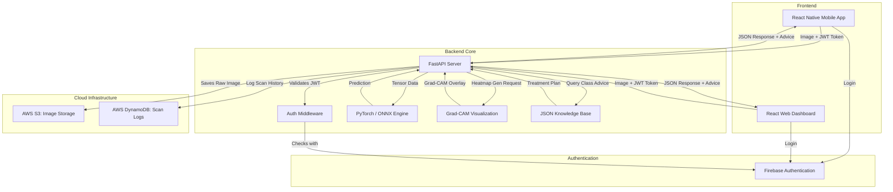
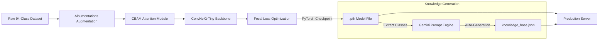

<div align="center">
  <h1>PlantPulse</h1>
  <p>A cross-platform application for crop disease diagnosis and treatment recommendations.</p>
  <br />
  <p>
    
    
    
    
    
    
  </p>
</div>

---

## Overview

PlantPulse helps identify plant diseases from photos of crop leaves. 

It uses a custom-trained ConvNeXt-Tiny architecture with a CBAM (Convolutional Block Attention Module) to detect 94 different crop conditions across several plant species, including tomato, apple, potato, sugarcane, tea, rice, jute, guava, cotton, corn, cauliflower, banana, and papaya.

Once a diagnosis is made, PlantPulse provides a treatment plan that includes chemical and organic treatment options, nutrient recommendations, and pruning advice tailored to the specific condition.

---

## System Architecture 

PlantPulse is organized as a monorepo with three main components: a FastAPI backend, a React web dashboard, and a React Native mobile application. 



### 1. apps/api/ (FastAPI)
The backend API server handles the core logic.
- ML Inference: Runs the model to generate predictions.
- Grad-CAM Visualization: Uses PyTorch to generate visual gradient class activation maps (Grad-CAM), highlighting where the model focused on the leaf.
- Authentication: Validates JWT tokens using the Firebase Admin SDK.
- Cloud Storage and Logging: Uses AWS S3 to store uploaded leaf images and DynamoDB to log scan history.
- Knowledge Base: Serves automated agricultural advice retrieved from a structured JSON file.

### 2. apps/web/ (React + Vite + TailwindCSS)
The responsive web dashboard for desktop and mobile browsers.
- Integrates Firebase JS SDK for Google Sign-in.
- Built with Tailwind CSS for styling.

### 3. apps/mobile/ (React Native + Expo)
The native iOS and Android application.
- Uses expo-camera and expo-image-picker for capturing photos.
- Manages user sessions via AsyncStorage and communicates with the backend via Axios.

---

## Model and Training Pipeline

We built a custom architecture to focus on the specific visual features of leaf diseases.



### The Architecture
We started with ConvNeXt-Tiny to balance speed and accuracy, and added a custom CBAM (Convolutional Block Attention Module) layer. This module forces the network to focus on the diseased lesions on the leaf rather than background soil or healthy tissue. We also upgraded the classifier head to a deeper MLP for better decision boundaries.

### Dataset and Preprocessing
The model was trained on a dataset containing 94 classes of healthy and diseased crops.
- Augmentation: We used Albumentations to apply random resized crops, affine transformations, HSV shifts, motion blur, and random sun flares to simulate real-world field conditions.
- Loss Function: We used Focal Loss to handle class imbalances in the dataset, ensuring rare diseases are still learned effectively.
- TTA: Test-Time Augmentation is used during inference to average predictions across multiple variations of the input image, improving overall confidence.

### How We Built It
1. Training Environment: The model was trained using PyTorch, utilizing Hugging Face Datasets for streaming and Weights & Biases for metric logging.
2. Automated Knowledge: We created a pipeline (apps/api/scripts/generate_knowledge.py) that uses Google's Gemini API to generate treatment advice, nutrient requirements, and pruning guidelines for all 94 classes, which is saved as a static JSON file.

---

## Training Metrics

- Training Loss / Validation Loss:
- 

- 

- Training Accuracy / Validation Accuracy:
- 

- 

---

## Setup and Installation

### API / Backend
```bash
# Move to the API directory
cd apps/api

# Create and activate a virtual environment
python -m venv venv

# Windows
.\venv\Scripts\activate
# Mac/Linux
source venv/bin/activate

# Install dependencies
pip install -r requirements.txt

# Start the server (Alternatively, run "npm run dev:api" from the root directory)
python -m uvicorn app.main:app --host 0.0.0.0 --port 8000 --reload
```
*(Note: To test the mobile app on a physical device, start the server using --host 0.0.0.0)*

### Web
```bash
# Move to the Web directory
cd apps/web

# Install dependencies and start the dev server
npm install
npm run dev
```

### Mobile
```bash
# Move to the Mobile directory
cd apps/mobile

# Install dependencies and start Expo
npm install
npx expo start
```

## Configuration
To run this project locally, you need to provide your own `.env` files.
* Backend: Requires AWS Keys (AWS_ACCESS_KEY_ID), Firebase Admin SDK JSON credentials, and S3/DynamoDB configuration.
* Frontend/Mobile: Requires Firebase Web Client configuration keys.

---
*Built for modern agriculture.*
